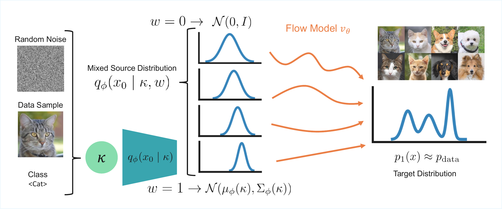

# MixFlow: Mixed Source Distributions Improve Rectified Flows


[Nazir Nayal](https://nazirnayal.xyz/), [Christopher Wewer](https://chrixtar.github.io/), [Jan Eric Lenssen](https://geometric-rl.mpi-inf.mpg.de/)

[[openreview](https://openreview.net/forum?id=uWktyU3OIJ)] [[arxiv](https://arxiv.org/abs/2604.09181)] [[bibtex](#citation)]





## Contributions

- We introduce **κ-FC**, a general formulation for conditioning the source distribution on an arbitrary signal that better aligns it with the data distribution.
- We propose **MixFlow**, a simple training strategy for rectified flows that mixes unconditional and conditional source distributions to reduce path curvature and improve sampling efficiency.
- We show that MixFlow improves the speed-quality trade-off and training convergence across **CIFAR-10**, **FFHQ 64x64**, and **AFHQv2 64x64**, outperforming standard rectified flow and prior baselines under fixed sampling budgets.

## Codebase Layout

```text
.
├── README.md
├── LICENSE
├── CITATION.cff
├── requirements.txt
├── assets/
│   └── figures/            # README and paper figures used in the release
├── config/
│   ├── dataset/            # dataset definitions
│   ├── experiment/         # official paper experiment configs
│   ├── model/
│   │   ├── denoiser/
│   │   ├── noise_predictor/
│   │   └── scheduler/
│   └── main.yaml           # base Hydra config
├── docs/
│   ├── CHECKPOINTS.md      # pretrained model release table
│   ├── DATASETS.md         # dataset preparation instructions
│   └── EXPERIMENTS.md      # experiment summary and reported numbers
├── scripts/
│   ├── dataset_tool.py     # dataset conversion utility for FFHQ/AFHQ
│   ├── run_curvature.sh    # curvature evaluation utility
│   ├── run_inference.sh    # generic inference entrypoint
│   └── run_train.sh        # generic training entrypoint
├── src/
│   ├── dataset/            # CIFAR-10, FFHQ, and AFHQv2 dataset loaders
│   ├── misc/               # logging, metrics, callbacks, and ODE utilities
│   ├── model/
│   │   ├── denoiser/       # SongUNet implementation
│   │   ├── diffusion/      # conditional source distribution predictor
│   │   └── loss/           # KL regularization losses
│   ├── schedulers/         # flow matching scheduler
│   └── visualization/      # image layout and annotation helpers
```

## Environment Setup

The project's experiments are implemented with Pytorch Lightning + Hydra configs.

1. Create a Python environment, for example with conda:

   ```bash
   conda create -n mixflow python=3.10 -y
   conda activate mixflow
   ```

2. Install a compatible **PyTorch + torchvision** build for your CUDA setup by following the official PyTorch instructions. The version on which this codebase was tested can be installed with

    ```bash
    pip install torch==2.7.0 torchvision==0.22.0 torchaudio==2.7.0 --index-url https://download.pytorch.org/whl/cu128
    ```

3. Install the remaining Python dependencies:

   ```bash
   pip install -r requirements.txt
   ```

4. Optional: enable Weights & Biases logging by setting `wandb.mode=online` and configuring your account.

## Datasets

The current paper release covers:

- CIFAR-10
- FFHQ 64x64
- AFHQv2 64x64

Dataset preparation details and expected folder layouts are documented in [docs/DATASETS.md](docs/DATASETS.md).

The dataset configs now support environment-variable overrides:

- `MIXFLOW_CIFAR10_ROOT`
- `MIXFLOW_FFHQ_ROOT`
- `MIXFLOW_AFHQV2_ROOT`

You can also override paths directly from the command line through Hydra, e.g. `dataset.root=/path/to/data`.

## Official Experiments

The current cleaned release focuses on these three paper experiments:

| Experiment | Config | Dataset | Resolution |
| --- | --- | --- | --- |
| CIFAR-10 | `cifar10` | CIFAR-10 | 32x32 |
| FFHQ 64x64 | `ffhq_64x64` | FFHQ | 64x64 |
| AFHQv2 64x64 | `afhqv2_64x64` | AFHQv2 | 64x64 |

See [docs/EXPERIMENTS.md](docs/EXPERIMENTS.md) for the reported settings and paper metrics.

## Training

Train one of the official experiments with:

```bash
bash scripts/run_train.sh cifar10
```

Multi-GPU training works by exposing more than one GPU to PyTorch Lightning. For example:

```bash
CUDA_VISIBLE_DEVICES=0,1 bash scripts/run_train.sh cifar10
```

Examples with dataset overrides:

```bash
bash scripts/run_train.sh cifar10 dataset.root=/path/to/cifar10-root
bash scripts/run_train.sh ffhq_64x64 dataset.root=/path/to/ffhq-64x64
bash scripts/run_train.sh afhqv2_64x64 dataset.root=/path/to/afhqv2-64x64
```

You can pass any Hydra override through the script, for example:

```bash
bash scripts/run_train.sh cifar10 wandb.mode=disabled trainer.max_steps=10000
```

## Inference

Run inference from a trained checkpoint with:

```bash
bash scripts/run_inference.sh cifar10 /path/to/model.ckpt outputs/inference/cifar10
```

For multi-GPU inference or evaluation, expose multiple GPUs before launching the script:

```bash
CUDA_VISIBLE_DEVICES=0,1 bash scripts/run_inference.sh cifar10 /path/to/model.ckpt outputs/inference/cifar10
```

You can override the sampling configuration directly, for example:

```bash
bash scripts/run_inference.sh cifar10 /path/to/model.ckpt outputs/inference/cifar10 \
  test.num_inference_timesteps=9 \
  test.ode_solver=manual_heun
```

For the higher-resolution experiments:

```bash
bash scripts/run_inference.sh ffhq_64x64 /path/to/model.ckpt outputs/inference/ffhq \
  test.num_samples=10000 \
  test.num_inference_timesteps=64

bash scripts/run_inference.sh afhqv2_64x64 /path/to/model.ckpt outputs/inference/afhq \
  test.num_samples=10000 \
  test.num_inference_timesteps=64
```

## Curvature Evaluation

To reproduce the paper-style curvature computation, use:

```bash
bash scripts/run_curvature.sh cifar10 /path/to/model.ckpt outputs/curvature/cifar10
```

The same pattern works across multiple GPUs:

```bash
CUDA_VISIBLE_DEVICES=0,1 bash scripts/run_curvature.sh cifar10 /path/to/model.ckpt outputs/curvature/cifar10
```

The public curvature script defaults to the paper setting of:

- Euler solver
- `128` inference steps
- `10000` sampled trajectories

You can still override Hydra parameters if needed, for example:

```bash
bash scripts/run_curvature.sh cifar10 /path/to/model.ckpt outputs/curvature/cifar10 \
  test.num_samples=5000 \
  test.num_inference_timesteps=64
```

## Pretrained Checkpoints

Official checkpoints are hosted on Hugging Face:

| Dataset | Config | Hugging Face Repo | Checkpoint | Download |
| --- | --- | --- | --- | --- |
| CIFAR-10 | `cifar10` | [`nazirnayal98/MixFlow-CIFAR10`](https://huggingface.co/nazirnayal98/MixFlow-CIFAR10) | `mixflow_cifar10.ckpt` | [download](https://huggingface.co/nazirnayal98/MixFlow-CIFAR10/resolve/main/mixflow_cifar10.ckpt) |
| FFHQ 64x64 | `ffhq_64x64` | [`nazirnayal98/MixFlow-FFHQ-64x64`](https://huggingface.co/nazirnayal98/MixFlow-FFHQ-64x64) | `mixflow_ffhqv2_64x64` | [download](https://huggingface.co/nazirnayal98/MixFlow-FFHQ-64x64/resolve/main/mixflow_ffhqv2_64x64) |
| AFHQv2 64x64 | `afhqv2_64x64` | [`nazirnayal98/MixFlow-AFHQ-64x64`](https://huggingface.co/nazirnayal98/MixFlow-AFHQ-64x64) | `mixflow_afhqv2_64x64` | [download](https://huggingface.co/nazirnayal98/MixFlow-AFHQ-64x64/resolve/main/mixflow_afhqv2_64x64) |

The full checkpoint index can also be mirrored in [docs/CHECKPOINTS.md](docs/CHECKPOINTS.md).

## Main Results

### CIFAR-10

| Method | Solver | NFE | FID ↓ |
| --- | --- | ---: | ---: |
| Rectified Flow | RK45 | 127.0 | 2.58 |
| FM-OT | RK45 | 142.0 | 6.36 |
| Minibatch-OT | RK45 | 133.9 | 3.58 |
| Fast-ODE | RK45 | 118.0 | 2.45 |
| QAC | RK45 | - | 2.43 |
| **MixFlow** | RK45 | 124.7 | **2.27** |

| Method | Solver | 5 NFE FID ↓ | 9 NFE FID ↓ |
| --- | --- | ---: | ---: |
| Fast-ODE | Heun | 24.40 | 9.96 |
| QAC | Heun | 19.68 | 10.28 |
| **MixFlow** | Heun | **19.29** | **8.97** |

### FFHQ 64x64

FID-10k across sampling budgets:

| Model | β | 4 | 5 | 10 | 20 | 32 | 64 | 128 |
| --- | ---: | ---: | ---: | ---: | ---: | ---: | ---: | ---: |
| Fast-ODE | 10 | **32.58** | 25.33 | 13.21 | 8.85 | 7.54 | 6.91 | 7.01 |
| Fast-ODE | 20 | 38.23 | 29.12 | 14.03 | 8.78 | 7.08 | 5.95 | 5.72 |
| Fast-ODE | 30 | 41.16 | 30.75 | 14.37 | 8.76 | 6.90 | 5.45 | 4.93 |
| **MixFlow** | **5e-5** | 33.72 | **25.04** | **12.23** | **7.52** | **5.31** | **4.01** | **3.75** |

### AFHQv2 64x64

FID-10k across sampling budgets:

| Model | β | 4 | 5 | 10 | 20 | 32 | 64 | 128 |
| --- | ---: | ---: | ---: | ---: | ---: | ---: | ---: | ---: |
| Fast-ODE | 10 | 21.80 | 18.04 | 11.80 | 9.05 | 8.22 | 7.47 | 7.21 |
| Fast-ODE | 20 | 25.73 | 20.11 | 10.56 | 6.89 | 5.74 | 4.92 | 4.55 |
| Fast-ODE | 30 | 30.84 | 23.08 | 11.17 | 6.66 | 5.37 | 4.40 | 3.96 |
| **MixFlow** | **5e-5** | **19.72** | **15.57** | **7.95** | **5.05** | **4.30** | **3.65** | **3.33** |

## Citation

If you use this code, please cite:

```bibtex
@inproceedings{
nayal2026mixflow,
title={MixFlow: Mixed Source Distributions Improve Rectified Flows},
author={Nazir Nayal and Christopher Wewer and Jan Eric Lenssen},
booktitle={ICLR 2026 2nd Workshop on Deep Generative Model in Machine Learning: Theory, Principle and Efficacy},
year={2026},
url={https://openreview.net/forum?id=uWktyU3OIJ}
}
```

## Notes

- Real-dataset FID statistics are cached automatically under `./stats`.
- Some utility files in the repository retain their original third-party license headers. Review [THIRD_PARTY_NOTICES.md](THIRD_PARTY_NOTICES.md) before redistribution or relicensing changes.
